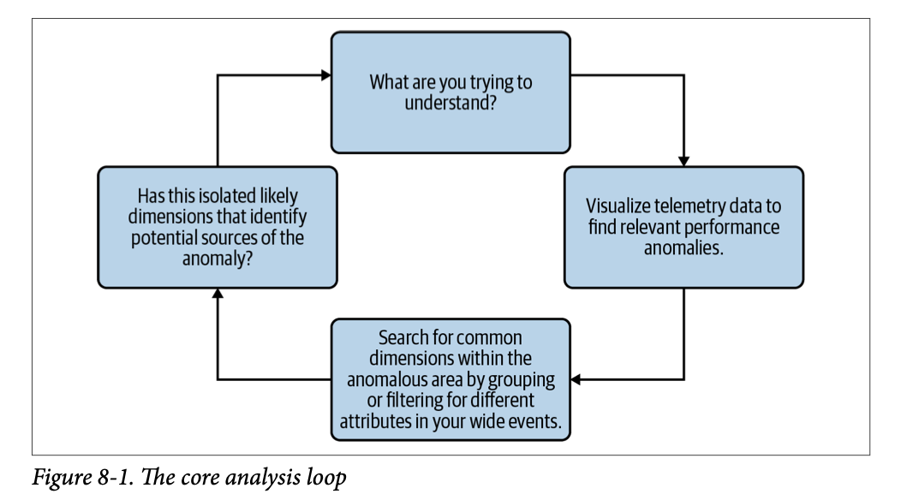

# Abbreviations

- **API** - Application Programming Interface
- **OS** - Operating System
- **PII** - Personally Identifiable Information
- **PICs** - Persons In Charge
- **RCA** - Root Cause Analysis
- **UoW** - Unit of Work
- **UUID** - Universally Unique Identifier

# Building Block of Observability

In order to adopt Observability as a standard practice across a project, the application needs to be built such that an ideal source of data/information is captured from the distributed system and stored in a remote storage suited for analytical purposes. Such data is categorized as telemetry data. 

Telemetry is the automatic operation of collecting analytical data of any system and transmitting it to a remote storage location. Telemetry operations have been applied in various industries prior to Software industry such as Aerospace, Automotive and Healthcare. The primary objective that prompted engineers to implement this functionality was to detect and understand potential failure points and failure sources of the mechanical device/human body. Failure scenarios that lie on long tail of event distributions (unknown unknowns) cannot be predicted by any means and can be efficiently addressed only with timely and noise-free raise of awareness to the critical situation, and depending on the data points gathered in the critical situation, PICs can take responsible actions.

For a software application in a distributed system (built with Microservice architecture), the ideal source of telemetry data that can be gathered is called a Structured Event. A structured event represents a snapshot of the application at any given time instance, describing the internal state based on a broad range of parameters (fields). 

## Structured Events

Structured events consist of

- Unique IDs (UUID)
- Variable values (rate limits, retry counts, pagination)
- Headers
- Query parameters
- Execution time
- Remote/external API calls
- Execution time of remote/external API calls

Caution must be taken that any PII such as API keys, name of user, email of user are not stored in any telemetry data. But after masking those data values, an attempt must be made to capture as many data points as possible. The reason for this is because the more data points present in an event, the more functionalities of the application gets captured (requests, background tasks, jobs, dependency interactions). In addition, obtaining correlations between two or more sources for a given incident becomes attainable, allowing for accurate RCA. 

A structured event must not be small enough to ignore crucial pieces of information describing the application internal state, nor should it be too wide to appear cluttered with information and make it cumbersome to navigate. But the collection of data points has to fall closer to the wider spectrum since it is always convenient to obtain more information without having to determine a fixed schema or perform predictions on possible sources of shifts in application dynamics. This mandates defining the right level of Abstractions before deciding on the wide collection of data points that need to be captured. An Abstraction does not have to provide the entire exhaustive list of fields to capture, but must be clear enough to allow engineers understand the overarching objective and make decisions on the successive steps to be taken from the starting point within the abstraction. 

A technical-based abstraction that gives us a starting point to determine the data points to be captured is

- Agnostic runtime information : Consists of
    - Container
    - Host
    - App version
    - DB version
- Request based information : Consists of
    - User ID
    - Session token
    - Headers
    - Query parameters

A software application can be broken down and represented as a collection of unit of works performing a required task. A unit of work is analogous to a process in an OS, meaning that the definition can vary depending on the context, requirements of various operations and features of the application. Sometimes, a simple function performing an input-output operation could be called a unit of work, other times it could be a process relying on remote calls, input-output, data storage and intermediate data processing to constitute in entirety a unit of work. 

Taking the definition and practical utility of an OS process, we can define the lifecycle of a process to clearly understand how an event needs to be structured. A process lifecycle consists of

- Input
- Processing (schema validation, type casting)
- Execution
- Output

Based on the above four stages of a lifecycle, structure of an event can be created as  

- Input of UoW
- Attributes of UoW
    - Computed
    - Resolved
    - Discovered
- Execution conditions of UoW
- Output of UoW

The benefits of collecting structured events lie along two lines

- Anomaly detection : Failure cases that are deemed unknown unknowns are anomalies (long tail) in any distribution of events. As such, humans need the ability to detect that at a given time instance, the application is in an anomalous state. The easiest approach (and ideally, complexity levels in the approach need to be kept as low as possible in order to avoid downstream biases influencing the decision) is to take the baseline/stable state, take the anomalous state and see any deviations based on difference between stable state and anomalous state. Over a long time duration, enough events can be captured and collected that would facilitate in performing this deviation calculation. In most cases, relying on historical events might not provide the necessary analysis for noticing the deviation, in which case the application must be capable of sampling events at a higher rate (say 1000 events per second) which would further increase the volume of events being captured.
- Correlations : Having decided on different abstractions using different angles of perception for the application, events can be created to capture an arbitrarily wide range of data points. These data points can be used to determine multiple sources involved in a given scenario (not necessarily a failure scenario). Narrowing down on the multiple sources involved allows engineers to deductively determine which of those sources are correlated in their contribution to the application internal state. One does not need to limit themselves in apprehending the multiple sources to agnostic data points of a software system but rather expand the viewpoint to obtain correlations between agnostic information and request-based information (like page load time to replica), or any combination of abstractions present within the captured event.

## Limitations of Metrics

Traditional metrics captured in telemetry data consists of obtaining a numeric value based on overall performance of a given component and pre-aggregating it based on defined buckets of time intervals. The pre-aggregation also involves a collection of standard mathematical functions applied to the collected metric value such as MIN, MAX, TOTAL, AVG, MEAN, MEDIAN, STD, p90, p99. Often times, most of the mathematical computations are not deemed necessary for determining the performance of the application, but the overall goal adopted is to obtain a level of granularity that can be used as an absolute indicator. Making this absolute enables engineers to comfortably depend on making deterministic decisions on application performance/status. But this defeats the purpose of Observability which aims to understand the internal state, not necessarily make deterministic conclusions (conclusions can be made subsequently after having a clear depiction of a failure scenario)

Traditional Metrics pose two problems :

- Pre-aggregation : Keeping aside the absolute nature of pre-aggregated metrics, the operation of aggregating a numeric describing system performance over a time interval bucket ignores and misses information that provides a description for each possible snapshot within the time interval bucket. Assuming one snapshot is obtained by one-tenth of a second and a bucket being 5 minutes, the pre-aggregation gives one value within the 5 minute interval where snapshots represented by events could provide 10 * 60 * 5 = 3000 numeric values within the same 5 minute interval. In addition, performing the mathematical computation over the 3000 numeric values obtained from events is going to provide the same pre-aggregated metric obtained with the Traditional approach
- Overall application performance : Traditional metrics provided value for Legacy software systems that were built using Monolithic architectures. Since all components of the application were condensed in location and simpler in architecture, any single component failing indicated the entire application was crashing. Engineers were capable of storing the internal state of the application inside their minds and using these mental models, make decisions on what metrics would provide valuable information for a failure scenario. But modern software systems with Microservice architecture in a Distributed system consists of decoupled and independent components. Failure in one component does not mean the entire application is crashing. In addition, within a single component, certain process/UoW could be failing without having to cause the entire component to crash. As such, metrics cannot be defined based on overall performance.

Metrics captured for modern software systems must consist of numeric values based on the collection of Abstractions employed to construct the event and must be stored inside each event (if possible). This allows the metric to provide an accurate representation of the internal state and facilitates deductive analysis leading to high probable conclusions rather than deterministic conclusions (limiting in nature).

## Limitations of Logs

Logs are sources of telemetry data that consist of operations, activities and usage of software application often stored as historical records. The term historical is key, as it depicts the process engineers take to debug an issue in an application. These issues can either be known unknowns or unknown unknowns since the scope of historical records has to cover all possible scenarios. There are no limitations to what data can be stored in logs (considering that general security standards and business standards are followed), thereby allowing engineers to rely on these sources of data for delayed debugging of issues in applications. Observability is not limited to delayed analysis, it allows engineers to perform real-time analysis of application performance and user impact and as such, logs cannot be extended for the purpose of real-time debugging.

Even for the purpose of delayed analysis, modern software systems raise problems in contrast to legacy software systems which can be addressed using a conversion from Unstructured logs to Structured logs. Reasons for mandating this conversion are :

- Distributed components : Since modern software systems consist of decoupled and independent components, each component has a different set of parameters that constitutes its overall performance. When the history of log records are checked in the telemetry storage, it will consist of a chaotic ordering of logs based on multiple components transmitting the log records to a centralized aggregator in addition to making the history of records larger in context.
- Different UoW : Software system consist of different UoWs depending on different functionalities of the application. Each UoW would consist of its own time span and execution history which would make it difficult to determine which log records can be abstracted out to a given UoW. UoWs need not necessarily be different based on components, a single component could perform various tasks, leading to multiple UoWs.

In unstructured logs, no easy modular approach or action steps can be taken in order to group the logs belonging to a single component or UoW. In structured logs, one can use data points for the given component or UoW being analysed and filter logs based on this data point to confidently check the log records pertaining to the past performance of the application. It must be noted that even structured logs fail to take into consideration the interdependency of components or UoW (parallel tasks) and lacks application dynamics, which are all needed to obtain accurate Observability.

# Tracing

Traces are telemetry data that capture the entire lifecycle of a request made to an application. It captures relationships between various services and components belonging to a particular request made. The higher the relationships, the larger the request complexity. This introduces additional challenges to the engineers involved in having a clear understanding of what happens in the request, especially if the dependency interactions are uncertain or unseen.

Compared to Structured Events, Traces capture a wide range of telemetry information based on the attributes specified in them. These attributes are similar to the Structured Event's fields. It is also possible to capture UoW that is not related to API requests using Tracers such as

- Background Tasks
- Pipeline operations
- Cron jobs
- Internal operations (file processing, caching)

In order to use Trace telemetry data for Observability, the team members within a project will have to rely on organic and real-world user interactions with the application. Larger the user base, higher the volume of Trace telemetry. Larger the requests made, broader the distribution of traces for a single request. But if these conditions are not met, then Traces might not be enough to obtain Observability. The decision on using either Traces or Structured Events lies on the project's objective, customer satisfaction requirements and technical practices adopted.

## Components of Traces

Traces consist of Spans. Each span represents telemetry information regarding a particular process in the request/UoW lifecycle. These Spans, if they consist of a wide range of attributes, will represent a Structured Event applied only for the process. In addition, all Spans (except the Root Span) have a parent-child relationship, leading to a Waterfall structure for the overall Trace being captured. 

Common attributes that are captured by Traces and are standard analytical data captured across all software applications include

- Trace ID
- Span ID
- Parent ID
- Timestamp
- Duration
- Service name
- Span name

These attributes are not enough to capture all the information required for Observability. As such, additional attributes can be included in a Span depending on the process being captured within the request/UoW of the application. These are going to be custom-tailored to the specific application being developed by the engineers. Some possible attributes that can be captured additionally are

- Application version (Deployment related)
- Database version (Deployment related)
- Host ID (Infrastructure related)
- User ID (Application related)
- Endpoint Parameters (Runtime related)

Defining a Span for a Trace would require decisions to be made on how a single process is defined. A definition of a process within a request/UoW would depend on the acceptable level of Abstraction for the application. Sometimes, it is possible to define a process based on a non-distributed/monolithic task (Monolithic here means Zero dependency interaction and the process only contains a single component or service to execute). Either approaches can be taken depending on team consensus.

# Instrumentation - OpenTelemetry

Telemetry data needs to be captured by writing code in the code base depending on the project scope. In general, all features developed would need to be written such that some form of telemetry data is captured for the feature developed, which often includes the endpoints, service level functions, database read/write operations, cache operations, any possible error or exception raises and external API calls within application feature execution. The process of collecting telemetry data for a UoW of an application is called Instrumentation.

In prior coding practices, instrumentation was done by installing necessary dependencies provided by the Backend collecting and storing the telemetry data. The dependencies provided specific methods to capture telemetry and export it to the required Backend store. This meant that if the developers involved in the project wanted to switch the Backend store provider or have multiple options of Backend store for managing telemetry, it was cumbersome since the code base had to be refactored according to a different dependency and specific methods provided by the latter dependency. This led to vendor lock-in, and limited code instrumentation scope and adoption.

Opentelemetry was a project that was initiated to solve the vendor lock-in hindrance encountered by most engineering teams. It allows developers to capture telemetry spanning logs, metrics and traces. In addition, Opentelemetry allows developers to store the telemetry data both in Open source and proprietary service providers. This increased flexibility established a standard approach to code Instrumentation, making it easier for telemetry data collection adoption across projects. Logging simply requires using a logger class object at necessary parts of a function. Likewise for traces, using the trace wrappers at required functions and function-blocks (depending on complexity of feature).

## Components of Opentelemetry

Opentelemetry consists of the following components that enables it to handle all three types of telemetry data for an application (metrics, logs, traces)

- Tracer : SDK component that is responsible for tracking a span under a current active process or UoW. As the particular UoW goes through multiple steps whilst interacting with various dependencies, knowing how to switch from one span to another and being able to maintain the linked relationship across all spans for the corresponding UoW is crucial to use Trace data with the right interpretations.
- Meter : SDK component that is responsible for tracking metrics. Depending on the overall architecture and stack utilized to build the application, engineers can consider incorporating a MeterProvider that captures business logic metrics and can be used to improve Observability under the 'How much/How fast' dimension, rather than being isolated to 'What' dimension during debugging/analysis.
- Context : SDK component that is responsible for deserializing and serializing context when it is being exchanged across smaller operations/spans along with tracking context for the current process being executed. 
- Exporter : Wrapper/Interceptor/Middleware that is responsible for exporting telemetry data locally (log files) or remotely. After a given UoW has finished the execution flow across various methods and objects, the telemetry data from within the code base needs exporting to an external source of telemetry storage.
- Collector : Standalone binary process that receives telemetry data, processes it and transmits it to configured destination. Unlike the Exporter, this only concerns itself with routing the telemetry data to the correct Backend Storage. It is possible for the application to have complex Infrastructure setup with multiple Backend stores for each type of telemetry. Having a dedicated component like a Collector would ensure that the operational burden of Exporter is isolated to the specific Backend store allocated to that Exporter object and Telemetry data does not get corrupted due to incorrect transactions during storage.

## Auto Instrumentation

The advantage of using Opentelemetry for code instrumentation is that the dependency has been developed to capture telemetry data for common operations that are implemented by the majority of projects under software development. This minimizes the burden on developers to concern themselves with having to instrument telemetry data for known, repeated and foundational UoW within the application. Some of the components that are automatically instrumented are 

- API requests
- Database/cache calls

Auto instrumentation has a different alias to it, often referred to as Zero-code instrumentation. The name suggests that developers do not need to write any code to capture the telemetry. In order for this to work, the code base needs to be setup such that the telemetry data is collected and exported based on frameworks such as Wrappers, Interceptors or Middleware that performs the required instrumentation.

## Main Design feature enabling Observability for any System

Opentelemetry has set the standards for collecting and storing Telemetry data at the highest level and has convinced developers across the world to adopt and incorporate packages in most of the application code bases. This has been independent of the purpose and objective of Observability in modern software systems. 

In order to benefit from the pragmatic aspects of Observability, engineers need to be able to navigate Telemetry data with the least amount of friction and confusion. This is due to the urgency and layers of code & human errors that needs to be mitigated followed by an acceptable level of resolution. For this to be feasible, the Collector has to be designed to accumulate all Telemetry data with the same origin source and correlate all Telemetry pillars with some form of shared context (correlation ID/trace Id/span ID). Correlating all pillars of Telemetry data enables engineers to know which traces need to be linked to which logs and filter out logs that might not be involved in a particular operation/UoW.

Non-OpenTelemetry collector components are designed as follows:

*Source: OpenTelemetry Official Documentation*

It can be seen from above that the Exporters work independently of each other and none of the Telemetry data are correlated. This leads to chaotic situations when incidents require quicker resolution.

On the other hand, OpenTelemetry collector components are designed as follows:

*Source: OpenTelemetry Official Documentation*

The contrast is clearly visible in the design pattern of OpenTelemetry collectors. Exporters are unified and fall under the same component and intermediate Telemetry data processing takes place which engenders correlation across all pillars.

# Events transformed for Observability

## Traditional Approaches

In traditional software systems that relied on monolithic architectures that were considerably simpler to construct and maintain, teams were organized such that engineers with the most experience remember and document all details related to the architecture and use predictable, previously encountered error scenarios to debug and resolve incidents. Runbooks and documentations were created and maintained as a consequence of managing teams in these traditional projects.

But with the advent of distributed systems, having the most experience or the best memory in the architecture is not the ideal approach to resolving incidents due to the high internal complexity of modern distributed systems. Moreover, this leads to reliance on intuition and implicit biases which could create an error scenario born out of human mistakes and leaves the incident in a worse situation than the original system effect.

With the accepted practice of maintaining runbooks and documents among development teams for a given modern system, it becomes even more important for everyone involved in the project to get familiar with the downsides of maintaining such documents. The purpose these documents serve in current projects is to share fundamental knowledge regarding the system to members who are unfamiliar with it or are newly onboarded to the project. When the scope of these documents and runbooks expand to solving all possible and predictable error scenarios, it becomes a never ending arms-race of creating and updating documents, which could give rise to episodes of incorrect documentation. And in times of incidents, incorrect documentation is a bigger detriment to the team and the system compared to no documentation. 

In order to adapt to modern systems, adopting and adhering to Instrumentation practices would be crucial since every time features are introduced, the core instrumentation logic for the application will not significantly change (other than manual instrumentation coverage) and as such, will never have incorrect data explaining the internal state and functionality of the application.

## Observability-oriented Approaches

If relying on experience or strong memory or intuition is pernicious to resolving incidents, the alternative that is more suitable is to debug from First Principles. First principles means that a given statement or description of an object/scenario is fundamental and cannot be broken down further in order to explain. First principles are the building blocks of every scientific experiment, relying on factual statements rather than implicit assumptions. Having any sort of assumption for a modern software system only complicates the process of obtaining observability when any given application is built with dependencies which are complex in nature themselves and whose contribution is hidden away from the engineering team in the form of API contracts.

Using first principles allows the engineering team involved in developing and maintaining the application to come up with hypotheses during an incident and different hypotheses can be validated using a structured approach, given that the required telemetry for observability is already in place (structured logging, distributed tracing, event snapshots).

One of the proposed system (in the book Observability Engineering) that teams can adopt is called Core-Analysis loop. This system approaches the RCA process in a cyclical manner that progresses based on interactive feedback.

### Core-Analysis Loop

One of the most important pre-requisites for any team starting to adopt the Core-Analysis loop system for observability and incident resolution is to have Telemetry in place, specifically Event snapshots. It is only these event snapshots that allow the engineering team to proceed with the steps laid out in this process.

Another point that needs a minor highlight is that detecting an issue in the application need not always be from an alert, although that is the ideal approach. Sometimes it can be initiated by a customer complaint as well. This offsets some of the burden of having to define strong SLO based alerts in the project when the team has little to no experience defining SLOs in the past.

Having mentioned that, below is the proposed system:

- Step 1 : Detect the issue from an alert (SLO based) or from a customer complaint
- Step 2 : Verify the issue based on anomalous behaviors - visual chart spikes, pattern breaks etc.
- Step 3 : Isolate the attributes that are leading causes of the incident encountered
  - Filtering sample event snapshots
  - Finding pattern changes based on a collection of event attributes
  - Reducing the dimensions further to isolate correlation and deduct probable causation
- Step 4 : If the number of dimensions have not been reduced to a deterministic state, or if the causation is not conclusive due to inadequate evidence, perform Step 1 again sequentially

The Core-Analysis loop progresses with a higher time to resolve when done in a completely manual approach, thereby worsening incident resolution metrics such as MTTD, MTTR. One of the steps (specifically step 3) can be automated to a certain extent by pursuing the following approach :

- Collect the events considered baseline performance
- Collect the events that are outliers and record the incident occurrence
- Perform a diff between the baseline and outlier event sample base to obtain the event attributes that provide probable causation with the highest magnitude difference. 

This automation does not require domain knowledge, project expertise or use of advanced tools like AI/ML and can be performed with a simple backend algorithm of performing differences. Incorporating this automation in the Core-Analysis loop enhances the team's ability to learn and adopt Observability practices without having to go through burnouts or deal with suspicions either in the system or in the learning process.

The extent to which any engineering team relies on AI/ML as a tool for better Observability or better SRE in general should only be determined by what AI is capable of during these real-time production issues. AI models are most capable in data processing, computation algorithms and pattern recognition, whereas humans are most capable at cognitive analysis and pragmatic awareness. Teams cannot tolerate delayed incident resolutions and waste precious time figuring out the RCA while also having to deal with model errors in anomaly detection or incomplete error resolution. Instead, AI needs to be leveraged with the right approach of using it for crunching large amounts of telemetry data using computation to arrive at intermediate steps. Once intermediate steps have been reached, humans in the middle of the incident resolution process provide their cognitive and pragmatic opinions on the situation being faced and guide the AI models in the right direction. Acting on incidents with human-AI collaboration is what leads to quicker and more efficient resolutions in an ideal world (certain pitfalls would still need to be addressed such as human miscalculation, AI false positives).

# Observability and Monitoring cohesion

Traditional monitoring systems have been developed over time under projects that involved monolithic architectures. All the best practices that have been discovered iteratively apply for the prominent factors that were of concern to engineering teams involved in those respective projects.

Some of the best practices include

- Alerting based on warning conditions that are assessed using numeric values (metrics)
- Storing monitored metrics in time-series databases for better loading of telemetry datasources
- Setup runbooks for frequent incidents to resolve issues efficiently

Some of the factors concerning the utility of Monitoring include

- Addressing unknown conditions of known failure modes
- Taking a reactive approach to incident or bug resolution (warning alerts)
- Prioritized focus on system components

As and when software architectures migrated from monoliths to microservices, a separation of concern arose between what we call a system and what we call an application. In modern software projects, engineers are forced to acknowledge and be capable of clearly defining the boundary between system and software within their own projects since different projects have different scopes and deliverables. Traditional monitoring still holds merit in current software projects so long as it is applied only to Systems. 

Observability, on the other hand, needs to be applied deterministically towards all operations and consequences of application code. Factors that would allow an engineer to follow along in order to determine the necessity of Observability are

- Operations that require more proactivity in being able to understand Production performance
- All features that are accessed by end user and impact user experience
- Deployment processes within the engineering team that introduces application code changes in Production

## System vs Software

Every project starts with certain business requirements for the product that they wish to develop and provide to end users. When the business requirements are shared among the engineering team with a generic comprehension, these requirements provide the needed perspective to define what constitutes a Software. 

But having engineers work on code changes as per business requirements does not mean that the product can be launched to the end user. Various dependencies, vendors, provisions play crucial roles in the engineering team's ability to create a deployable product to the market for the end user to have access to it rather than the end user accessing an immaterial code base. These dependencies and components that are required to be installed, configured and occasionally updated for the product's deployment to Production constitute a System.

A system provides the essentials (needs) for an engineering team that allows them to focus on the software deliverable catering user's expectations (wants). 

Depending on the scope of the project that the team is involved in, preference towards Monitoring or Observability changes. This can be viewed in a spectrum of Monitoring on one side and Observability on the other. If the team takes responsibility in providing system components that behave more like hardware components or that which require following real-world physical constraints (virtual machines), then monitoring is critical since that allows the engineering team to assess the performance of their product along the lines of physical constraints which can be represented easily in numeric forms (possibly applied in appropriate equations). If instead the product being worked on involves greater levels of abstraction towards concepts and ideas that are free of physical constraints, these fall suitably to the definition of Software described above and demands increased abilities of Observability within the engineering team since behaviors of abstractions can never be easily predicted due to lack of constraint limits.

  

    Physical hardware behavior and operations <strong>(Hardware)</strong>
    Logical provisions of physical constraints on components <strong>(Platform)</strong>
    Highly capable algorithms and models offered as services <strong>(Backend)</strong>
    Web and mobile apps used by normal people <strong>(Apps)</strong>
  

  

  

    Monitoring
    Observability
  

## Hybrid Observability-Monitoring scopes among various Service providers

As mentioned in the spectrum, one can represent different projects that development teams have contributions into four categories

### Hardware/Infrastructure services

These type of services represent products like bare-metal system where the engineering team is involved in configuring and organizing various physical components within a server that can be used by cloud platform providers or mobile network providers. It has a high reliance on Monitoring approaches to resolve problems in the services offered. Some of the factors that needs to be considered under Monitoring are

- Firmware versions
- Secondary storage or I/O file system performance statistics
- Port counters
- Temperature sensors and thermal metrics
- Power consumption metrics

### Platform services

These type of services represent a Cloud Platform where various dependencies of an application can be configured and setup for engineering teams to proceed working on software projects. This is generally referred to as Infrastructure that the software engineering team relies upon. Some of the most important factors that are Monitored include

- Domain Name System (DNS) counters
- Disk statistics
- Router connections
- Database connection pool metrics
- Message queue depth
- Network throughput and packet loss

### Backend/API services

These type of services represent an API layer that certain software engineering teams can use under their project without having to develop the same complicated repertoire of algorithms required for building a feature. Complicated algorithms or models are delegated to external vendors who specialize in developing them. This can also include vendors who are primarily capable of solving a specific set of problems within a niche and have to follow certain business rules in order to offer their specialization. Some of the factors either Monitored or Observed that determine a healthy API service integration are

- Execution time (throughput and latency)
- Execution space (memory and disk storage)
- Dependency service availability
- Error rates and exception types
- Query/script performance

### User facing applications

These are the types of products that every individual is familiar with when defining what a Software represents. End users who use the application never have to concern themselves with the technology used to develop the same. As such, every attempt to analyse the application performance has to be thought from the perspective of what the end user experiences, which is high in Observability. Important factors that engineering teams need to consider to Observe the application thoroughly are

- User journey completion rates
- Feature usage patterns
- Client-side error rates
- Page load times and rendering performance
- User session durations
- Click-through rates and interaction patterns

Being able to deduce and explain internal workings on factors described above does not mean that the engineer responsible need not be aware of the technical details. To the contrary, their depth of technical awareness is what allows them to observe the internal workings of the application with certainty and meticulously (e.g. : a part of function logic is being responsible for delay in a service layer function call which slows down feature performance in UI) even if the factors being considered are abstracted to a business level perspective usually employed by project or product managers (e.g. : feature usage pattern).

## Ideal Middle Ground

Having described the different types of software projects that teams can work on, the need for Observability is reasonably high for teams primarily focused on writing code to create Applications or Backend APIs. Under these projects, the value of Monitoring systems can be strategically evaluated based on the following point

> Higher level Infrastructure metrics like CPU usage, Disk write activity, Queue active messages that are **correlated** to Application code performance. From a causation perspective (specific example), deployment of new feature creates a spike in Infrastructure component metric for an extended time interval.

Only when the Infrastructure metrics being monitored have any correlation to Application code performance do the metrics contain importance. During incident resolutions, Monitoring system setup for the software application can be assessed first to see any discrepancies or anomalies in these metrics with the sole intent of **ruling-out** contribution of Infrastructure in the incident encountered. Once the team has decided with certainty that the Infrastructure is not the reason why the incident occurred, they need to swiftly shift towards their Observability system to figure out which part of the Application code is causing the problem.
